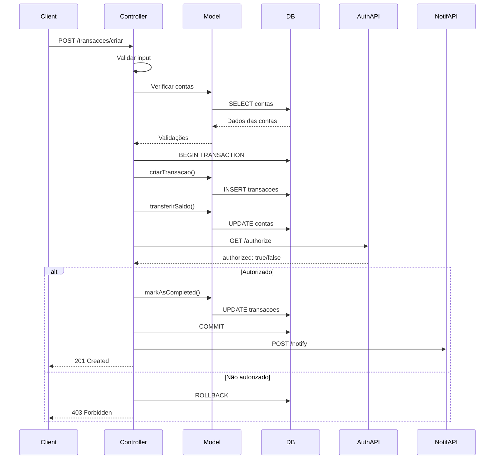

# Architecture Documentation - Projeto1

## Overview

Sistema de transações financeiras construído com CodeIgniter 4 seguindo padrões MVC com Services Layer para integração com APIs externas.

## Arquitetura Geral

```
┌─────────────────┐    ┌─────────────────┐    ┌─────────────────┐
│   Client App    │    │   Web Client    │    │   Mobile App    │
└─────────┬───────┘    └─────────┬───────┘    └─────────┬───────┘
          │                      │                      │
          └──────────────────────┼──────────────────────┘
                                 │
                    ┌─────────────▼─────────────┐
                    │      Apache Web Server     │
                    │        (Port 8080)         │
                    └─────────────┬─────────────┘
                                 │
                    ┌─────────────▼─────────────┐
                    │    CodeIgniter 4 App       │
                    │   (PHP 8.4 + MVC)          │
                    └─────────────┬─────────────┘
                                 │
          ┌──────────────────────┼──────────────────────┐
          │                      │                      │
┌─────────▼─────────┐  ┌─────────▼─────────┐  ┌─────────▼─────────┐
│   Controllers    │  │     Models        │  │     Services      │
│                   │  │                   │  │                   │
│ • Transacoes      │  │ • UsuariosModel   │  │ • Authorization   │
│ • (API Endpoints) │  │ • ContasModel     │  │ • Notification    │
└───────────────────┘  │ • TransacoesModel │  │   Service         │
                       └───────────────────┘  └───────────────────┘
                                 │
                    ┌─────────────▼─────────────┐
                    │      MySQL Database       │
                    │    (localhost:3306)       │
                    └───────────────────────────┘
```

## Camadas da Arquitetura

### 1. Presentation Layer (Controllers)

**Responsabilidade**: Receber requests HTTP, validar input, orquestrar fluxo

**Arquivo**: `app/Controllers/Transacoes.php`

**Principais métodos**:
```php
public function criar() // POST /transacoes/criar
```

**Características**:
- Usa CodeIgniter ResponseTrait para respostas JSON
- Validação de input básica
- Orquestração do fluxo de transação
- Tratamento de exceções

### 2. Business Logic Layer (Models)

**Responsabilidade**: Regras de negócio, persistência de dados

**Arquivos**:
- `app/Models/UsuariosModel.php`
- `app/Models/ContasModel.php`
- `app/Models/TransacoesModel.php`

**Principais métodos**:
```php
// TransacoesModel
criarTransacao($data)
transferirSaldo($de, $para, $valor)
markAsCompleted($id, $authCode)

// ContasModel
getSaldo($id)
updateSaldo($id, $novoSaldo)
```

### 3. Integration Layer (Services)

**Responsabilidade**: Comunicação com APIs externas

**Arquivos**:
- `app/Services/AuthorizationService.php`
- `app/Services/NotificationService.php`

**Características**:
- Abstração de APIs externas
- Tratamento de timeouts e falhas
- Configuração de SSL e headers
- Logging de erros

## Fluxo de Transação



## Padrões e Princípios

### 1. MVC Pattern

- **Model**: Lógica de negócio e dados
- **View**: Respostas JSON (via ResponseTrait)
- **Controller**: Orquestração e HTTP handling

### 2. Service Layer Pattern

- Separação de responsabilidades de integração externa
- Abstração de APIs terceiras
- Facilita testes e manutenção

### 3. Repository Pattern (implícito)

- Models encapsulam acesso a dados
- Abstração de queries SQL
- Centralização de lógica de persistência

### 4. Transaction Script

- Fluxo de transação linear no controller
- Passos bem definidos e sequenciais
- Tratamento de rollback em caso de falha

## Estrutura de Dados

### Database Schema

```sql
-- Usuários
CREATE TABLE usuarios (
    id INT PRIMARY KEY AUTO_INCREMENT,
    nome VARCHAR(255) NOT NULL,
    email VARCHAR(255) UNIQUE NOT NULL,
    tipoUsuario ENUM('cliente', 'lojista') NOT NULL
);

-- Contas
CREATE TABLE contas (
    id INT PRIMARY KEY AUTO_INCREMENT,
    idUsuario INT NOT NULL,
    saldo DECIMAL(10,2) DEFAULT 0.00,
    FOREIGN KEY (idUsuario) REFERENCES usuarios(id)
);

-- Transações
CREATE TABLE transacoes (
    id INT PRIMARY KEY AUTO_INCREMENT,
    de INT NOT NULL,
    para INT NOT NULL,
    valor DECIMAL(10,2) NOT NULL,
    status ENUM('pending', 'completed', 'failed') DEFAULT 'pending',
    authorization_code VARCHAR(255),
    created_at TIMESTAMP DEFAULT CURRENT_TIMESTAMP,
    FOREIGN KEY (de) REFERENCES contas(id),
    FOREIGN KEY (para) REFERENCES contas(id)
);
```

## Configuração e Ambiente

### Environment Variables

```php
// app/Config/Database.php
public array $default = [
    'hostname' => 'localhost',
    'username' => 'root',
    'password' => 'gdb21a@#',
    'database' => 'projeto1',
    'DBDriver' => 'MySQLi'
];
```

### Service Configuration

```php
// AuthorizationService
protected $authorizationUrl = 'https://util.devi.tools/api/v2/authorize';

// NotificationService  
protected $notificationUrl = 'https://util.devi.tools/api/v2/notify';
```

## Segurança

### Implementações

1. **Input Validation**: Validação de campos obrigatórios
2. **Transaction Integrity**: ACID compliance com rollback
3. **Business Rules**: Validação de saldo, tipo usuário, etc.
4. **Error Handling**: Logging de erros sem expor detalhes sensíveis
5. **SSL Configuration**: Configuração para APIs externas

### Considerações

- SQL Injection mitigado pelo Query Builder do CodeIgniter
- XSS protection habilitado por padrão
- CSRF tokens (se necessário para web forms)

## Escalabilidade

### Pontos de Melhoria

1. **Database**: Connection pooling, read replicas
2. **Caching**: Redis para sessões e cache
3. **Queue System**: Para notificações assíncronas
4. **Load Balancer**: Múltiplas instâncias da aplicação
5. **Monitoring**: Health checks e métricas

### Arquitetura Futura

```
┌─────────────┐    ┌─────────────┐    ┌─────────────┐
│   LB/NGINX  │    │   Redis     │    │   RabbitMQ  │
└──────┬──────┘    └──────┬──────┘    └──────┬──────┘
       │                  │                  │
┌──────▼──────┐    ┌──────▼──────┐    ┌──────▼──────┐
│   App #1    │    │   App #2    │    │   App #N    │
└─────────────┘    └─────────────┘    └─────────────┘
       │                  │                  │
       └──────────────────┼──────────────────┘
                          │
              ┌───────────▼───────────┐
              │   MySQL Master/Slave  │
              └───────────────────────┘
```

## Testes

### Estratégia de Testes

1. **Unit Tests**: Models e Services
2. **Integration Tests**: Controllers com database
3. **End-to-End Tests**: Fluxo completo
4. **Load Tests**: Performance e escalabilidade

### Ferramentas Sugeridas

- **PHPUnit**: Unit e integration tests
- **Codeception**: E2E tests
- **Postman/Newman**: API testing
- **JMeter**: Load testing

## Monitoramento e Logging

### Log Strategy

```php
// Log levels
log_message('error', 'Transaction failed: ' . $e->getMessage());
log_message('warning', 'Notification failed: ' . $e->getMessage());
log_message('info', 'Transaction completed: ' . $idTransacao);
```

### Métricas Importantes

- Transaction success rate
- Response time
- Error rate por endpoint
- Database connection pool
- External API response times
